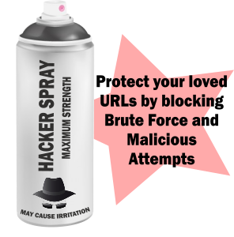

# Hacker Spray

 

A .NET library to defend websites against brute force attacks and malicious attempts. Protect login, registration, password reset pages against brute force attacks. Block users from performing any action too many times. Prevent too many hits from any IP or IP Range. Blacklist/Whitelist specific IP, IP range, username, URLs, transactions for a period.

# How it works

Hacker Spray uses Redis to maintain high performance counters for actions and origin IPs. Clients call ``HackerSpray.Defend(key, ip)`` to check if a certain key or IP has made too many hits. Clients can maintain blacklists for key, IP or IP Range. HackerSpray checks against too many hits on a key, too many hits on a IP, or IP falling within blacklists.

Example calls:

```c#
HackerSpray.Defend("/Account/LogOn", Request.UserHostAddress);
HackerSpray.Defend("/Account/PasswordReset", Request.UserHostAddress, TimeSpan.FromMinutes(5), 100);
HackerSpray.Defend("Username" + username, Request.UserHostAddress);
HackerSpray.Defend("Comment", Request.UserHostAddress);
```

Hacker Spray is a fully non-blocking IO, .NET 4.5 async library, maximizing use of Redis pipeline to produce least amount of network traffic and latency. It uses the ``StackExchange.Redis`` client.

# Getting Started
## Nuget
Get the Hacker Spray library and HTTP Module to defend your website using:

    Install-Package HackerSpray.WebModule

## Source code
Download the source code. The HackerSpray.Module contains the library to implement your own defence. 

HackerSpray.WebModule contains HackerSprayModule, which you can use to defend certain URL against brute force attack.

## Using Hacker Spray
### Step 1
In the web.config you need to specify the following:

```xml
<add key="RedisConnection" value="localhost" />
<add key="RedisPrefix" value="AuthTest:" />
<add key="PathToDefend" value="/Account/LogOn" />
<add key="HackerSprayEnabled" value="true" />
```
 - RedisConnection - This is the connection string to Redis server.
 - RedisPrefix - All keys created in redis is prefixed with this.
 - PathToDefend - If you are using the HttpModule, specify the Path which it will defend against brute force
 - HackerSprayEnabled - A Master switch to turn on/off

### Step 2
In Global.asax, you need to enable the HackerSpray functionality:

```c#
if (Convert.ToBoolean(ConfigurationManager.AppSettings["HackerSprayEnabled"]))
{
    HackerSprayer.Store = new RedisDefenceStore(ConfigurationManager.AppSettings["RedisConnection"], ConfigurationManager.AppSettings["RedisPrefix"], HackerSprayer.Config);
    HackerSprayModule.PathToDefend = ConfigurationManager.AppSettings["PathToDefend"] ?? "/";
}
```