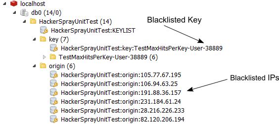

# Hacker Spray

 

**A .NET library to defend websites and web APIs against brute force and Denial-of-service attacks.**

It comes as .NET 4 and .NET Core library.

## Features:

 * Protect login, registration, password reset pages against brute force and DOS attacks. 
 * Block users from **performing any action too many times**. 
 * Prevent too many hits from any IP or IP Range. 
 * Blacklist/Whitelist specific IP, IP range, username, URLs, transactions for a period.

An example scenario is a Bank Login page, where brute force password attempts on user accounts and DOS attack on Login page are a regular event. 
Using this library, you can protect login page from brute force attacks, blocking too many usernames from certain IPs, 
or too many hits from a range of IP trying to do DOS attack, 
or even simple 3 invalid login attempts per username, per 15 mins. 

This high performance, very lightweight library protects you from hitting the database too many times on pages or APIs that are target for attacks, thus lowering web server and database CPU, increasing the scalability of the overall application.

# Show me the speed

Let's compare the performance of a Login page which does authentication with a database. 

## Server throughput increase
When attack is going on and expensive .net code is getting hit, you get high CPU and low throughput. But as soon as Hacker Spray starts blocking traffic, CPU on webserve goes down and server throughput shots high up.


## Response time 

When ASP.NET code is executing, response time is avg 36ms, as you see on the top 2 lines. But when Hacker Spray is blocking requests, response time is low, at around 8ms. 


## Prevent code execution

When Hacker Spray is not blocking request, response code is 403 for invalid logins from Controller, which indicates expensive Login code is getting hit. But as soon as Hacker Spray starts blocking, it responds with 406, right from the httpmodule, thus avoiding hit to Controllers. 


# How it works

Hacker Spray uses Redis to maintain high-performance counters for actions and origin IPs. 
Clients call ``Hacker.Defend(key, ip)`` to check if a certain key or IP has made too many hits. 
Clients can maintain blacklists for key, IP or IP Range. 
HackerSpray checks against too many hits on a key, too many hits on an IP, or IP falling within blacklists. 
It also allows blacklisting a certain key for a certain IP or blocking a certain key for all IPs on-the-fly. 
Handy when you want to block a user out of certain URLs. 

It comes with a HttpModule, which protects your entire website. 

Example calls:

```c#
var result = await Hacker.DefendAsync("/Account/LogOn", Request.UserHostAddress);
if (result == Hacker.Result.TooManyHitsFromOrigin)
    await Hacker.BlacklistOriginAsync(Request.UserHostAddress, TimeSpan.FromMinutes(10));
else if (result == Hacker.Result.TooManyHitsOnKey)
    await Hacker.BlacklistKeyAsync("/Account/LogOn", TimeSpan.FromMinutes(10));

.
.
.
Hacker.DefendAsync("/Account/PasswordReset", Request.UserHostAddress, TimeSpan.FromMinutes(5), 100);
Hacker.DefendAsync("Username" + username, Request.UserHostAddress);
Hacker.DefendAsync("Comment", Request.UserHostAddress);
```

Hacker Spray is a fully non-blocking IO, .NET 4.5 async library, maximizing use of Redis pipeline to produce least amount of network traffic and latency. It uses the ``StackExchange.Redis`` client.

There's a convenient ``DefendAsync`` overload for ASP.NET Controllers. Here's an example how you can protect the Login() method:

```c#
[HttpPost]
[AllowAnonymous]
[ValidateAntiForgeryToken]
public async Task<ActionResult> Login(LoginViewModel model, string returnUrl)
{
    if (!ModelState.IsValid)
    {
        return View(model);
    }

    return await Hacker.DefendAsync<ActionResult>(async (success, fail) =>
    {
        // This doesn't count login failures towards account lockout
        // To enable password failures to trigger account lockout, change to shouldLockout: true
        var result = await SignInManager.PasswordSignInAsync(model.Email, model.Password, model.RememberMe, shouldLockout: false);
        switch (result)
        {
            case SignInStatus.Success:
                return await success(RedirectToLocal(returnUrl));
            case SignInStatus.LockedOut:
                return await fail(View("Lockout"));
            case SignInStatus.RequiresVerification:
                return await success(RedirectToAction("SendCode", new { ReturnUrl = returnUrl, RememberMe = model.RememberMe }));
            case SignInStatus.Failure:
            default:
                ModelState.AddModelError("", "Invalid login attempt.");
                return await fail(View(model));
        }
    },
    blocked => new HttpStatusCodeResult(HttpStatusCode.Forbidden),
        "ValidLogin:" + model.Email, 3, TimeSpan.FromMinutes(5),
        "InvalidLogin:" + model.Email, 4, TimeSpan.FromMinutes(5),
        Request.GetClientIp()
    );
}
```

This ``DefendAsync`` allows you to wrap your existing Controller code with the defence. 
You put the existing code in your Controller methods inside the ``async (success, fail)`` delegate.
Then while returning the response object, you wrap the return object with ``success()`` or ``fail()``. 
HackerSpray will then maintain success and failure counters. 
If there are too many success or failed attempt as per the configuration, it will block further execution 
of the code inside the delegate, thus protecting your expensive business logic from attacks. 

# This is so wrong!

"This is absolutely wrong approach! Why on earth will you do this at application code level? This should be done at firewall level!", you say?

Couple of reasons:

 - Firewalls have no intelligence on what business transaction is being performed. Thus you cannot implement brute force check against certain transactions. It is either URL or IP.
 - If a firewall has to implement brute force attack detection, it has to read the whole payload and then inspect for patterns. This requires excessive CPU usage on Firewall. In case of https, it requires you to terminate https at firewall level so that it can read the received data.
 - Most firewalls have simple scripting language to configure rules. Some do support javascript like programming, but check the CPU cost of that and the price tag.

With that being said, you should use Firewall for certain cases and Hacker Spray for different cases. You should use Firewall to limit maximum number of connects per IP, maximum number of connections opened to a webserver, rate limit, blacklisted IP and URLs. More than that, go for HackerSpray. It is better to perform CPU intensive operations at webserver level, because you have plenty of them. Usually you have only one active firewall and thus best not to put CPU intensive operation on them. 


# Getting Started
## Nuget
Get the Hacker Spray library and HTTP Module to defend your website using:

    Install-Package HackerSpray

For .NET Core, use:

    Install-Package HackerSprayCore

Or you can just drop the Hacker.XXX.dll files in the bin folder and proceed with the configuration.

## Source code

``Hacker.WebModule`` project contains ``HackerSprayHttpModule``, which you can use to implement configuration driven centralized defense for the entire website.

## Using Hacker Spray
### Step 1
In the ``web.config`` you need to specify which paths to protect using the ``HttpModule``, if you are planning to use the HttpModule. 

```xml
<HackerSprayConfig redis="localhost" prefix="AuthTest:">
    <keys>
      <add name="/Account/LogOn/" post="true" maxAttempts="100" interval="00:10:00" mode="perkeyperorigin" />
      <add name="/Home/" post="false" maxAttempts="10000" interval="00:01:00" mode="perorigin" />
      <add name="/" post="false" maxAttempts="10000" interval="00:01:00" mode="perorigin" />
    </keys>
  </HackerSprayConfig>
```
 - **redis** - This is the connection string to Redis server.
 - **prefix** - All keys created in redis is prefixed with this.
 - **keys** - one entry per path that you want to protect
    - **name** - The Path to match
    - **post** - true = POST, false = GET
    - **maxAttempts** - max number of hits to allow
    - **interval** - hits for how long?
    - **mode** - How to count the hits and apply blocking
      - _perkey_ - count hits from all IPs to this key. For ex, allow maximum 1000000 hits to Home page in 10 minutes period.
      - _perorigin_ - While checking hits to this key, if the origin IP has produced more than the maxAttempts hit overall on any key, then block. For ex, allow 1000 hits per IP, to any key, but do this check on Login page hit.
      - _perkeyorigin_ - Count hits to this key, per IP. For example, 1000 hits per IP on the Login page. 

### Step 2
Add the Hacker Spray ``HttpModule`` in web.config:

```c#
<system.webServer>    
    <modules runAllManagedModulesForAllRequests="true">
      <remove name="HackerSprayHttpModule" />
      <add name="HackerSprayHttpModule" type="Hacker.WebModule.HackerSprayHttpModule" />
    </modules>    
  </system.webServer>
```

### Step 3

Run a [Redis](http://redis.io/) node or a [cluster](http://redis.io/topics/cluster-tutorial) of Redis nodes. Provide the redis connection string in IP:host form in the web.config. If you are running multiple nodes in the cluster, provide IP:host for all nodes. 

That's all!

### Step 4

**Warning!**
If you have a Load Balancer, then you need to configure the Load Balancer to send the original Client's IP as the Request IP to the webserver. Or it must pass the original Client IP in a ``X-Forwarded-For`` header. **This is very important**. Hacker Spray maintains its counters using the Client IP. If the Client IP is the Load Balancer's IP, not the original Client's IP, then it will lock out the load balancer, causing total outage on your website. 


# Operational Monitoring & Dashboards

## Administration

You can use any Redis Administration Application to view the blocking going on. For example, using Redis Desktop Manager, you can view which keys and IPs have been blacklisted:



On this view, HackerSprayUnitTest is a prefix used to store all entries in Redis. 

Underneath it, there's ``key`` and ``origin``. Key contains all the keys that are now being blocked. For example, here you see User-38889 has been blacklisted.

Under ``origin``, you see all the IPs that have been blacklisted from performing any hit to the URLs protected by Hacker Spray.

If you want to add a new IP to be blacklisted, you just add an entry here.

If you want to whitelist an IP, just remove the entry.

Changes are reflected on all webservers immediately. 

Clicking on any of these entries in Redis will show you how many hits have been made. 

## Logging

The .net 4 version uses .NET Tracing to write to logs. The format of the log is in unix syslog format, which makes it easy to feed into analysis tools like Elastic Search.

```
Jun 19 12:06:48 hostname HackerSpray: [Information] HackerSprayWebDefence Path matched: /Account/LogOn
Jun 19 12:06:48 hostname HackerSpray: [Verbose] Hits: /Account/LogOn	3	0.0.0.1	5 3
Jun 19 12:06:48 hostname HackerSpray: [Verbose] Defend: 1
Jun 19 12:06:48 hostname HackerSpray: [Verbose] Hits: InvalidLogin:user1	3	0.0.0.1	6 3
Jun 19 12:06:48 hostname HackerSpray: [Verbose] Defend: 1
Jun 19 12:06:49 hostname HackerSpray: [Information] HackerSprayWebDefence Path matched: /Account/LogOn
Jun 19 12:06:49 hostname HackerSpray: [Verbose] Hits: /Account/LogOn	4	0.0.0.1	7 4
Jun 19 12:06:49 hostname HackerSpray: [Verbose] Defend: 1
Jun 19 12:06:49 hostname HackerSpray: [Verbose] Hits: InvalidLogin:user1	4	0.0.0.1	8 4
Jun 19 12:06:49 hostname HackerSpray: [Verbose] TooManyHitsOnKey: InvalidLogin:user1
Jun 19 12:06:49 hostname HackerSpray: [Information] Blacklist Key: InvalidLogin:user1
```

The log shows you how long ``Hacker.Defend`` function is taking to execute, which URLs it is intercepting, and which keys are getting blocked. 

.NET Core has a newer log format, which looks like this:

```
2016-06-19 11:55:33.206 +01:00 [Warning] Invalid password for user "c0266265-b71b-417d-b9d1-4e44a3f7300c".
2016-06-19 11:55:35.499 +01:00 [Warning] User "c0266265-b71b-417d-b9d1-4e44a3f7300c" failed to provide the correct password.
2016-06-19 11:55:37.676 +01:00 [Warning] Invalid password for user "c0266265-b71b-417d-b9d1-4e44a3f7300c".
2016-06-19 11:55:37.678 +01:00 [Warning] User "c0266265-b71b-417d-b9d1-4e44a3f7300c" failed to provide the correct password.
2016-06-19 11:55:38.959 +01:00 [Warning] Invalid password for user "c0266265-b71b-417d-b9d1-4e44a3f7300c".
2016-06-19 11:55:38.960 +01:00 [Warning] User "c0266265-b71b-417d-b9d1-4e44a3f7300c" failed to provide the correct password.
2016-06-19 11:55:40.077 +01:00 [Warning] Invalid password for user "c0266265-b71b-417d-b9d1-4e44a3f7300c".
2016-06-19 11:55:40.077 +01:00 [Warning] User "c0266265-b71b-417d-b9d1-4e44a3f7300c" failed to provide the correct password.
2016-06-19 11:55:40.096 +01:00 [Warning] Blocked: 0.0.0.1 user1@user.com
2016-06-19 11:55:46.465 +01:00 [Warning] Blocked: 0.0.0.1 user1@user.com
```

## Measuring performance impact 


## FAQ

### Cannot connect to redis

 - Check if redis server running.
 - Check if you can telnet in to the redis port. 
 - Check if port is configured properly in connection string.

### Logging does not work

 - 

### Invalid Login attemps are not getting blocked

### Hacker Spray is not blocking any request after too many hits

Make sure the HttpModule (.net 4) or the Middleware (.net core) has been properly registered. 

For .net core, see the sample project's Startup.cs how to proper register it. It is very important you register the middleware right after StaticFile handler. 

Ensure you haven't set the numbers too high in configuration.